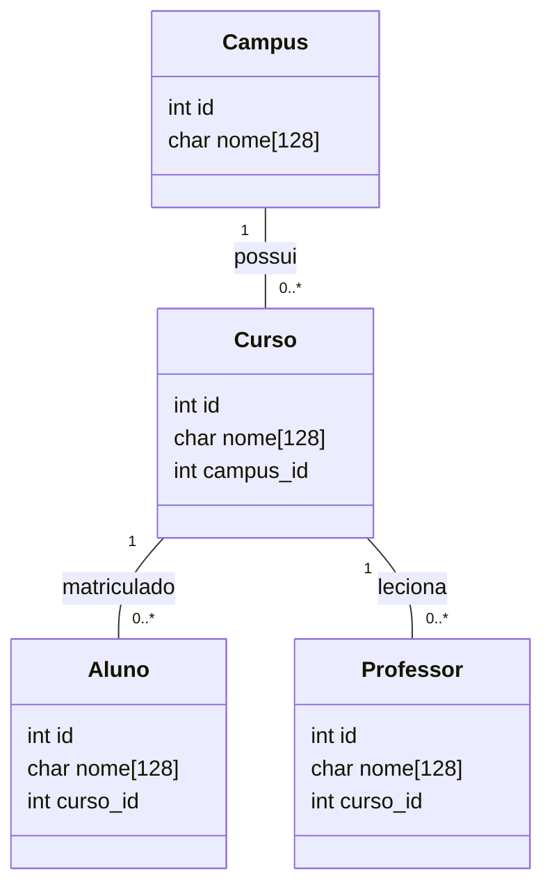

Sistema de cadastro simples em C para universidade

Este projeto demonstra armazenamento via arquivo (CSV) e uma alternativa com SQLite.

Compilação:

- Build simples (uso de arquivos CSV):

    make

- Build com SQLite (se tiver libsqlite3 instalada):

    make sqlite

Execução:

    ./university

Arquivos principais:
- src/main.c: interface CLI
- src/models.h: definições de structs
- src/storage_file.c/h: armazenamento em CSV
- src/storage_sqlite.c/h: exemplo com SQLite (compilar com `make sqlite`)

Objetivo: servir como referência para discutir desafios de armazenamento em arquivo vs. banco de dados.

**Diagrama de Models**

Abaixo está um diagrama Mermaid que mostra as estruturas definidas em `models.h` e as relações básicas entre elas (Campus -> Curso -> Aluno/Professor).

Esse diagrama pode ser usado em apresentações para explicar como os dados se relacionam e as dificuldades de manter integridade e consultas quando se usa arquivos planos em vez de um SGBD.